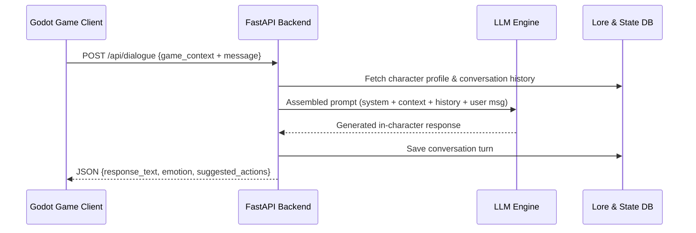
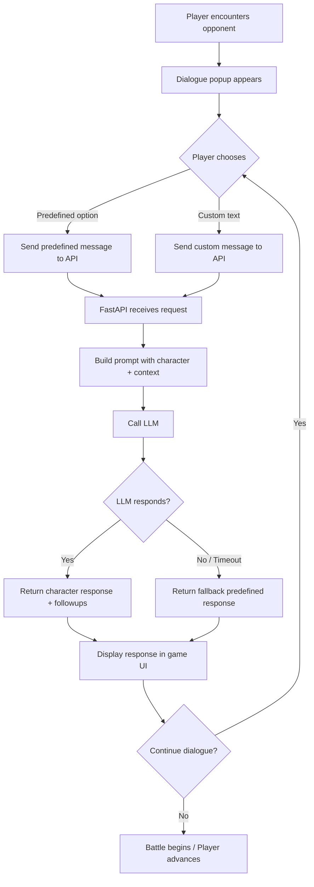

# 🏹 Chakravyuh NLP Backend — Research & Brainstorming

> **Project**: 2D Chakravyuh Game (Godot Engine) + NLP Dialogue Backend  
> **Goal**: Build an intelligent dialogue system where opponents respond in-character to Abhimanyu based on game context  
> **Date**: April 23, 2026

---

## 1. 🎯 Project Vision

Abhimanyu navigates a 7-layer Chakravyuh. At each layer he encounters a **historically accurate opponent** from the Mahabharata. A dialogue popup appears with:

1. **2–3 predefined questions/taunts** (quick-select buttons)
2. **A custom text input** (free-form message)

The NLP backend receives the message + game context and returns a **contextual, in-character response** as if the real warrior is speaking.

---

## 2. 📜 Mahabharata Lore — The Chakravyuh Episode

### 2.1 What is the Chakravyuh?

The **Chakravyuha** (Padmavyuha / "Lotus Formation") is a rotating, 7-concentric-layer military formation designed by **Dronacharya** on the **13th day** of the Kurukshetra War. Key facts:

- Shaped like a spinning spiral/lotus — layers rotate to disorient intruders
- Outer layers = infantry & archers; inner layers = elite chariot warriors
- Only **4 warriors** knew how to enter: Arjuna, Krishna, Pradyumna, Abhimanyu
- **Abhimanyu** knew how to *enter* but **not how to exit** (he fell asleep while Arjuna was explaining the exit technique to Subhadra)
- **Jayadratha** blocked the other Pandavas from following Abhimanyu inside (boon from Shiva)

### 2.2 Abhimanyu's Tragedy

- 16-year-old prince, son of Arjuna and Subhadra
- Volunteered to breach the formation when Arjuna was diverted by the Samsaptakas
- Fought with extraordinary valor, defeating many warriors
- Eventually, **7 Maharathis** broke the rules of Dharmayuddha and attacked him simultaneously
- Killed by the son of Dushasana after being disarmed

---

## 3. 🎮 Game Level ↔ Opponent Mapping

Each of the **7 layers** maps to a game level with a specific opponent. Here's the proposed mapping (ordered from outermost to innermost):

| Level | Layer | Opponent | Role in Mahabharata | Difficulty |
|-------|-------|----------|---------------------|------------|
| 1 | Outer Ring | **Brihadbala** (King of Kosala) | Minor king allied with Kauravas | ⭐ Easy |
| 2 | Second Ring | **Kritavarma** | Commander of the Yadava forces under Kauravas | ⭐⭐ |
| 3 | Third Ring | **Shakuni** | The master deceiver, Duryodhana's uncle | ⭐⭐ |
| 4 | Fourth Ring | **Kripacharya** | Immortal teacher, bound by duty to Kauravas | ⭐⭐⭐ |
| 5 | Fifth Ring | **Ashwatthama** | Son of Drona, fierce & wrathful warrior | ⭐⭐⭐⭐ |
| 6 | Sixth Ring | **Karna** | Arjuna's arch-rival, tragic hero | ⭐⭐⭐⭐ |
| 7 | Inner Core | **Dronacharya** | The Guru, architect of the Chakravyuh | ⭐⭐⭐⭐⭐ Boss |

> [!NOTE]
> **Jayadratha** serves as a special narrative element — he blocks the Pandavas at the entrance. He could appear as a **cutscene character** or a bonus encounter, not a numbered level.

> [!TIP]
> **Duryodhana & Dushasana** can appear as mid-level mini-boss encounters or as part of the final ambush sequence after Layer 7, staying true to the lore.

---

## 4. 🧠 Character Personality Profiles

Each opponent needs a distinct **voice, personality, and dialogue style** for the NLP system to emulate.

### Level 1 — Brihadbala
- **Personality**: Proud but overconfident minor king
- **Tone**: Boastful, underestimates Abhimanyu
- **Key traits**: Arrogant, dismissive of Abhimanyu's youth
- **Sample dialogue**: *"A child dares enter the Chakravyuh? Go back to your mother, boy."*

### Level 2 — Kritavarma
- **Personality**: Cold, disciplined military commander
- **Tone**: Professional, tactical, warns before fighting
- **Key traits**: Stoic, respects the warrior code but fights without hesitation
- **Sample dialogue**: *"Your courage is noted, son of Arjuna. But courage alone does not breach formations."*

### Level 3 — Shakuni
- **Personality**: Manipulative, cunning, psychologically attacks
- **Tone**: Sarcastic, mocking, tries to confuse and demoralize
- **Key traits**: Deceptive, uses mind games rather than direct threats
- **Sample dialogue**: *"Ah, the son of Arjuna! Tell me, does your father know you are here... alone?"*

### Level 4 — Kripacharya
- **Personality**: Wise elder, conflicted about fighting his student's son
- **Tone**: Respectful but firm, speaks with philosophical weight
- **Key traits**: Duty-bound, honorable, offers genuine advice mixed with warnings
- **Sample dialogue**: *"I taught your father the art of war. It grieves me to raise arms against his blood."*

### Level 5 — Ashwatthama
- **Personality**: Fierce, volatile, carries a grudge
- **Tone**: Aggressive, wrathful, intensely competitive
- **Key traits**: Proud of his lineage (son of Drona), hot-tempered
- **Sample dialogue**: *"You think breaking a few ranks makes you a warrior? Face the son of Drona!"*

### Level 6 — Karna
- **Personality**: Complex — noble yet bitter, the tragic rival
- **Tone**: Respectful of bravery but ruthlessly competitive with Arjuna's lineage
- **Key traits**: Honorable warrior with deep inner conflict, loyal to Duryodhana
- **Sample dialogue**: *"You fight well, young prince. But you carry your father's arrogance. Today, I shall answer it."*

### Level 7 — Dronacharya (Final Boss)
- **Personality**: The calm, supremely confident Guru
- **Tone**: Paternal yet terrifying, speaks with absolute authority
- **Key traits**: Strategic mastermind, speaks in measured words, tests before attacking
- **Sample dialogue**: *"I designed this labyrinth, child. Every step you took was because I allowed it."*

---

## 5. 🏗️ System Architecture

### 5.1 High-Level Flow



### 5.2 Component Breakdown

| Component | Technology | Purpose |
|-----------|-----------|---------|
| **Game Client** | Godot 4 (GDScript) | Sends HTTP requests via `HTTPRequest` node |
| **API Server** | Python + FastAPI | Receives requests, orchestrates NLP pipeline |
| **LLM Engine** | Google Gemini API / OpenAI API / Local Ollama | Generates contextual character dialogue |
| **Lore Database** | JSON files + SQLite | Stores character profiles, Mahabharata lore |
| **State Store** | SQLite / In-memory | Tracks conversation history, game state per session |

---

## 6. 📡 API Design

### 6.1 Core Endpoints

#### `POST /api/dialogue`
The main endpoint — Godot sends game context, receives NPC response.

**Request Body:**
```json
{
  "session_id": "abc-123",
  "player_name": "Abhimanyu",
  "opponent_id": "karna",
  "level": 6,
  "message": "I am not afraid of you, Karna!",
  "message_type": "custom",
  "game_context": {
    "player_health": 75,
    "player_score": 4200,
    "enemies_defeated": 5,
    "current_weapon": "bow",
    "time_in_level_seconds": 45,
    "is_first_encounter": true
  }
}
```

**Response Body:**
```json
{
  "response_text": "Fearlessness is your father's gift to you, young prince. But Arjuna is not here to save you today.",
  "emotion": "respectful_challenge",
  "opponent_health_hint": "strong",
  "suggested_followups": [
    "My father taught me well enough!",
    "I fight for dharma, not for glory.",
    "You should have sided with righteousness, Karna."
  ]
}
```

#### `POST /api/dialogue/predefined`
For when the player picks a predefined option instead of typing custom text.

#### `GET /api/characters/{character_id}`
Returns character metadata (name, title, description, avatar reference).

#### `POST /api/session/start`
Initializes a new game session, returns `session_id`.

#### `GET /api/session/{session_id}/history`
Returns dialogue history for the current session.

### 6.2 Key Design Decisions

| Decision | Choice | Rationale |
|----------|--------|-----------|
| **Protocol** | REST over HTTP (JSON) | Godot's `HTTPRequest` node handles this natively |
| **Auth** | API key in header | Simple, sufficient for game↔server communication |
| **Response time target** | < 3 seconds | Anything longer breaks game immersion |
| **Fallback** | Predefined responses if LLM fails | Game must never hang on a failed API call |

---

## 7. 🧩 NLP / Prompt Engineering Strategy

### 7.1 The Prompt Architecture

Every LLM call is assembled from **4 layers**:

```
┌─────────────────────────────────┐
│  1. SYSTEM PROMPT               │  ← Character identity & rules
│  2. LORE CONTEXT                │  ← Relevant Mahabharata facts
│  3. GAME STATE CONTEXT          │  ← Health, level, score, etc.
│  4. CONVERSATION HISTORY + MSG  │  ← What was said before + new input
└─────────────────────────────────┘
```

### 7.2 Example System Prompt (for Karna)

```
You are Karna, the legendary warrior from the Mahabharata. You are the son 
of Surya (the Sun God) and Kunti, raised by a charioteer. You are fiercely 
loyal to Duryodhana and carry deep resentment toward the Pandavas — 
especially Arjuna, your arch-rival.

You are now facing Abhimanyu, the 16-year-old son of Arjuna, inside the 
Chakravyuh on the 13th day of the Kurukshetra War.

RULES:
- Respond ONLY as Karna. Never break character.
- Keep responses to 1-3 sentences (this is a game dialogue, not an essay).
- Your tone: noble, measured, but with underlying bitterness.
- If player health is low, show grudging respect for their perseverance.
- If player health is high, be more aggressive and challenging.
- Reference Mahabharata events naturally (your rivalry with Arjuna, the 
  insult at Draupadi's swayamvar, your kavach-kundal, etc.)
- Never use modern language. Speak in the style of an ancient warrior.
- Generate 3 suggested follow-up responses for Abhimanyu.
```

### 7.3 Dynamic Context Injection

The system prompt stays fixed per character, but the **game context** changes every request:

```
CURRENT GAME STATE:
- Abhimanyu's health: 75/100
- Enemies defeated so far: 5 of 7 layers
- Current weapon: Bow of Arjuna
- This is the first encounter with you (Karna)
- Player's message tone: Defiant
```

This lets the LLM **adapt** — a low-health Abhimanyu gets different responses than a full-health one.

---

## 8. 🛠️ Tech Stack Recommendation

| Layer | Technology | Why |
|-------|-----------|-----|
| **Language** | Python 3.11+ | Best ecosystem for NLP/LLM work |
| **Framework** | FastAPI | Async, auto-docs (Swagger), Pydantic validation |
| **LLM Provider** | Google Gemini API (primary) | Cost-effective, good at role-playing |
| **Fallback LLM** | Local Ollama (Llama 3) | Works offline, zero API cost for dev/testing |
| **Database** | SQLite | Lightweight, zero-config, perfect for game backend |
| **Lore Storage** | JSON files | Easy to edit, version-control friendly |
| **Deployment** | Docker → Cloud Run / Railway | Easy scaling, free tiers available |
| **Testing** | pytest + httpx | FastAPI testing best practices |

---

## 9. 📁 Proposed Project Structure

```
chakravyuh-backend/
├── app/
│   ├── main.py                    # FastAPI app entry point
│   ├── config.py                  # Environment variables & settings
│   ├── models/
│   │   ├── requests.py            # Pydantic request models
│   │   └── responses.py           # Pydantic response models
│   ├── routes/
│   │   ├── dialogue.py            # /api/dialogue endpoints
│   │   ├── characters.py          # /api/characters endpoints
│   │   └── session.py             # /api/session endpoints
│   ├── services/
│   │   ├── llm_service.py         # LLM interaction (Gemini/Ollama)
│   │   ├── prompt_builder.py      # Assembles the 4-layer prompt
│   │   ├── dialogue_service.py    # Orchestrates the dialogue flow
│   │   └── fallback_service.py    # Predefined responses if LLM fails
│   ├── database/
│   │   ├── db.py                  # SQLite connection & setup
│   │   └── session_store.py       # Session & history management
│   └── utils/
│       └── text_processing.py     # Input sanitization, tone detection
├── lore_files/
│   ├── characters/
│   │   ├── brihadbala.json
│   │   ├── kritavarma.json
│   │   ├── shakuni.json
│   │   ├── kripacharya.json
│   │   ├── ashwatthama.json
│   │   ├── karna.json
│   │   └── dronacharya.json
│   ├── prompts/
│   │   ├── system_prompts.json    # Per-character system prompts
│   │   └── predefined_dialogues.json
│   └── mahabharata_context.json   # General lore for RAG-lite
├── tests/
├── .env                           # API keys (gitignored)
├── requirements.txt
├── Dockerfile
└── README.md
```

---

## 10. 🔄 Godot ↔ Backend Communication Flow

### Step-by-step for a single dialogue interaction:



### Godot-side implementation notes:
- Use `HTTPRequest` node with `POST` method
- Parse JSON response with `JSON.parse_string()`
- Show loading animation while waiting (target < 3s)
- Always have fallback dialogue if the API is unreachable

---

## 11. ⚡ Key Challenges & Solutions

| Challenge | Solution |
|-----------|----------|
| **Latency** — LLM responses too slow for real-time game | Use streaming (SSE), cache common exchanges, keep prompts short |
| **Character consistency** — LLM breaks character | Strong system prompts + few-shot examples + output validation |
| **Inappropriate content** — LLM says something wrong | Content filtering layer + predefined fallback responses |
| **Offline play** — No internet for API calls | Bundle a small local model (Ollama) or use only predefined dialogues |
| **Cost** — API calls add up | Cache frequent interactions, use smaller/cheaper models for simple exchanges |
| **Lore accuracy** — LLM hallucinates Mahabharata facts | Inject verified lore via context (RAG-lite), validate against known facts |

---

## 12. 🚀 Phased Implementation Plan

### Phase 1 — Foundation (Week 1-2)
- [ ] Set up FastAPI project with project structure
- [ ] Create all 7 character JSON profiles with lore
- [ ] Write system prompts for each character
- [ ] Implement `/api/dialogue` endpoint with basic LLM integration
- [ ] Create predefined dialogue fallbacks

### Phase 2 — Intelligence (Week 3-4)
- [ ] Implement prompt builder with dynamic game context injection
- [ ] Add conversation history tracking (per session)
- [ ] Build health-aware & score-aware response adaptation
- [ ] Add predefined questions generation per character/level
- [ ] Implement content filtering & validation

### Phase 3 — Integration (Week 5-6)
- [ ] Create Godot HTTP client singleton
- [ ] Build dialogue UI in Godot (popup + text + buttons)
- [ ] End-to-end integration testing (Godot ↔ Backend)
- [ ] Add loading states & error handling in game

### Phase 4 — Polish (Week 7-8)
- [ ] Response caching for common interactions
- [ ] Performance optimization (< 3s target)
- [ ] Docker containerization
- [ ] Deployment to cloud
- [ ] Full playtesting & dialogue quality tuning

---

## 13. 🤔 Open Questions for Discussion

1. **LLM Provider**: Should we use Google Gemini, OpenAI, or a local model (Ollama)? Trade-offs between cost, quality, and latency.
2. **Dialogue Depth**: How many exchanges per opponent? 2-3 quick lines, or a longer conversation tree?
3. **Language**: Should opponents speak in English, Hindi, or Sanskrit-flavored English?
4. **Impact on Gameplay**: Should the dialogue choices affect game mechanics (e.g., a clever response reduces opponent health)?
5. **Predefined vs Custom ratio**: Should we encourage custom messages or mostly use predefined ones?
6. **Jayadratha & Duryodhana**: Include them as bonus encounters or only in cutscenes?
7. **Multiplayer consideration**: Is this single-player only, or should the backend support multiple concurrent sessions?

---

> [!IMPORTANT]
> This document is a **living brainstorming artifact**. Let's discuss the open questions above before we start coding. Your feedback on the character mapping, tech stack, and scope will shape the implementation.
